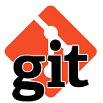

#  Build Server

This is your private build server running in Docker containers.

The goal of this workshop is to give you some hands-on experience with the apps listed in the menu bar on the bottom.

----

<small> **Page navigation** :

  - Just press **Space** for the next slide
  - **Down** goes to the next page within a chapter
  - **Right** skips to the next chapter
  - For more keyboard shortcuts: press **?**
</small>

##  GitBlit &mdash; Introduction (1)

The first requirement for practicing [Continuous Integration](https://en.wikipedia.org/wiki/Continuous_integration) is using a version control system for the project's source code, aka **SCM**, which stands for _Source Code/Control Management_.

By far the most popular SCM is [Git](https://git-scm.com/). You probably have a [git client](https://git-scm.com/downloads) installed on your PC, often integrated with your IDE. If not, now is a good time!

Having a local repository is already a step forwards, but if you're working in a team on the same code base, it makes sense to host it on a server.

##  GitBlit &mdash; Introduction (2)

[GitBlit](http://gitblit.com/) is a basic repository management tool for hosting git repositories on your own server. 
It does not try to be a full collaborative development environment.
For example [GitHub](https://github.com/), [GitLab](https://about.gitlab.com/), [Phabricator](https://www.phacility.com/), [SCM Manager](https://www.scm-manager.org/), and [Tuleap](https://www.tuleap.org/)
offer more functionality like an integrated bug / issue ticket system, a wiki, online editing, etc.

Like [GitBucket](https://gitbucket.github.io/gitbucket-news/about/), GitBlit just hosts repositories. So for this workshop GitBlit is just fine.
<small>(NB: we planned to use GitLab, but that starts up too slow and preloading it with repositories was a headache)</small>

So let's give it a spin!

##  GitBlit &mdash; Repository Browsing

  - Click in the menu bar on __GitBlit__. 
	<small>_The first screen you see is the Dashboard, which is not that interesting._</small>
  - In the top menu pick the second option: **Repositories**. 
    <small>_We have pre-loaded a couple repositories from GitHub into GitBlit._</small>
  - Take a look at repository `jqno/equalsverifier`. 
    <small>_This is a quite mature project which uses tags & feature branches._</small>
  - On the **Overview** screen you can see some *commits* 
    <small>_Scroll down to see *tags* and *branches*._</small>

##  GitBlit &mdash; Question Time

  1. Can you locate the `readme.md` file?
  2. At what interval is an update published in the past year?
  3. Who or what is responsible for increasing the version number?
  4. There's currently three (or four) active branches. 
     Is that all there ever was?
  
<small>Press **S** to check your answers.</small>

Note: Answers: 1. Menu option **Tree** or **Docs**. 2. On average once a month. 3. The `maven-release-plugin`. 4. No, there were countless branches for issues & features. After the _merge_ of a branch back into the `master` it's obsolete and deleted. It's just a bookmark...

##  GitBlit &mdash; Register & Login

You haven't seen the most important repository because it needs authentication:

  - Login with user&ensp;`root`&ensp;& password&ensp;`sysadmin`
  - Open the&ensp;&ensp;menu at the top right and select **Users** (_Gebruikers_)
  - At the top right there's a link to create a new user so fill in that form.
  - Do select 'admin' (_mag beheren_) <small>(other options at your own risk)</small> and save.
  - Log out and try to log in again using your own account

Now you can access our repository **OrdinaJTech/fordintysa-ci**

##  GitBlit &mdash; Clone the Repository

We'll be making some small changes to some files in our repository, so you need to make a clone to your own computer.

  - On the overview screen of our repository&ensp;`OrdinaJTech/fordintysa-ci`&ensp;you'll find the attribute **repositorie url**. 
    <small/>The quickest way to copy the url is to click on the  icon between the words `.git` and `RW+`.</small>
  - Use your favorite tool to make a clone of the repository.
  - Test whether the code compiles and all unit tests pass by executing&ensp;`mvn clean test`

<small>NB: this workshop is about Continuous Integration. You may import this project in your IDE (Netbeans, Eclipse, IntelliJ) 
but you should be able to do without, and just use a plain text editor. And ofcourse a Git client...</small>

##  Push a commit to GitBlit

Let's test whether you can push a change to your own Gitblit server:

  - Change something in the `readme.md` file in your local repository.
  - **Commit** the change.
  - **Push** the commit to the `origin`.
  - Check in **GitBlit** your commit has arrived.
  
You should now have a working Git infrastructure with a local and remote repository.

##  Jenkins &mdash; Introduction (1)

Now the SCM is covered, the next requirements of Continuous Integration need attention:

  1. An **Automated Build** process
  2. Automated **Testing** of the built software

While your IDE can perform these processes, there's no _guarantee_ each developer has done these required steps before submitting their changes to the central repository.
That's why we need it to be _automated_ and it's the role of a **Build Server** to execute this central part in Continuous Integration.

##  Jenkins &mdash; Introduction (2)

There's a [lot of software](https://en.wikipedia.org/wiki/Comparison_of_continuous_integration_software) available for automated builds & tests.
Which one to chose depends on a couple of factors, like the ability to integrate with the rest of the environment. Think of:

  - Connecting with the Source Code Repository
  - Ability to compile the source code and perform automated tests
  - Reporting of Static Code Quality Analysis
  - Delivery of the compiled code for deployment

<small>The strength of Jenkins lies in the fact that it is merely an execution skeleton, while specific **plugins** do specialised tasks.
For instance, look at the rich ecosystem supported by Jenkins for connecting with a SCM here: 
[https://plugins.jenkins.io/](https://plugins.jenkins.io/), in the left menu at the bottom under **Source Control Management**.
Multiple plugins for simular tasks and enhancing Jenkins' behaviour can be installed, so it can be made very simple or very complex.
All of this is open source and completely free. 
So let's try that out...<small>

##  Jenkins &mdash; Register & Login

  - Click in the menu bar on **Jenkins**. Use the bottom link to **signup as a new user**.
  - Fill in the form and click **sign up**.  
    _You should be welcomed with **Success**._
  - Click on the link to go **back to the top page**. 
    _You have woken up Jenkins and this is the first time it's being used. 
	It will show a screen **Customize Jenkins** to add extra plugins. 
	Skip that, since all the plugins you need for this workshop are already installed._
  - Click on the `x` at the top right to close this _Add Plugins_ window. 
    _Jenkins reports it's ready._
  - Click the button **Start using Jenkins**

##  Jenkins &mdash; Create your first Build Item

You're now at the main screen of Jenkins.

The list of projects it can build is still empty, but not for long:

  - Click on the link **Create new Item** (_Cre&euml;er nieuwe taken_)
  - Enter an appropriate item name (eg&ensp;`fordintysa`)
  - Select the box **Maven Build** (_Bouw een Maven item_) and click **OK**.

The item is now created, and we can configure it further.

##  Jenkins &mdash; Configure a Build Item

On the next pages we'll cover the most important parts of a Jenkins build item.

The first tab **General** is for, ehm... _generic_ stuff:

  - Give the item a name and a description
  - Specify to prompt for parameters (manual input)
  - Save disk space by deleting old data
  - Deactivate it to prevent a build is accidentally started

_We don't need these features yet, so leave them as is._

##  Configure Build Item &mdash; SCM (1)

Jenkins needs to clone our repository hosted by GitBlit, and it needs the URL.

  - Select **Git** as the SCM source.
  - Switch your browser window to **GitBlit**
  - Select the `fordintysa-ci` repository.
  - Put it's URL in your copy-paste buffer, as explained [previously](#/1/5)
  - Switch back to **Jenkins** and paste the URL.

You'll see an error message, because part of the URL is your GitBlit userid.
But the password is not given, and you're not going to let anyone else use that.
Not even someone as trustworthy as Jenkins!

##  Configure Build Item &mdash; SCM (2)

We've already set up credentials for Jenkins to connect with GitBlit, so let's use that:

  - Remove the part of the URL containing your userid.
  - In the Credentials dropdown box, select the _Jenkins credentials for Gitblit_.

Now the error message should be gone.

<small>There are a lot of other options in this section and others, too much to explain them all.
And most of them can/should be left at their default setting.
If you're really curious what it does, click on the question mark at the right to display a help text.</small>

##  Configure Build Item &mdash; Build Triggers (_Bouwactiveerders_)

Here you can define to let this item build on regular intervals, or triggered by a commit...

Since we're just starting with Jenkins, it's probably best to first trigger all builds manually.
You can do that anyway, but triggering builds automatically is not our first concern.
We first have to see whether it works at all before we can automate that.

<small>One of the build trigger items is checked by default: **Build whenever a SNAPSHOT dependency is built**.  
This needs some explanation. Usage of capital letters might give you the impression that *snapshot* is a deciding factor here. 
Well, no... That word should be in small caps between brackets. The emphasys should be on **dependency**. 
**Build whenever a _Dependency_ is built**, regardless whether that's a snapshot.  
Since our project has no dependencies that are also built by this Jenkins instance, this switch won't do anything.</small>

##  Configure Build Item &mdash; Build Environment (_Bouwomgeving_)

We keep all these options empty for now, except for the very last one.

  - Tick the last option: _Resolve artifacts from Artifactory_.
  - On the bottom right click the button **Refresh Repositories** 
    _ The repository for released versions is OK, but **snapshot** versions have a separate repo_
  - Select **libs-snapshot** as the _Resolution snapshots repository_.

<small>Artifactory is installed on your virtual build server, but if the plugin for it is not activated you won't see it in action.
Artifactory will intercept all requests that would normally go to the Maven Central repository, and act as a caching mirror.  
You might really need this if the project has dependencies with artefacts that are developed in-house and so are not available in the Maven Central repository.
There can be multiple build servers, so it makes sense to let these all fetch their dependencies from a central in-house location. Such as Artifactory.</small>

##  Configure Build Item &mdash; Pre Steps

This speaks for itself: you can specify some extra work to be done before the actual build is done. Not needed here....

But do observe this: as you're scrolling down that quite large page, the tab selection in the top menu does change accordingly.
So you can do both: scroll up & down or select a tab.

##  Configure Build Item &mdash; Build (_Bouwpoging_)

This is where it's realy happening. Here the Maven-specific aspects are configured.

The location of the `pom.xml` is OK <small>(root of the repository)</small>, but the Maven goals to execute not yet.

  - Fill in the **goals & options** for Maven you think are most appropriate. 
    <small>Need a hint? Press **S**...</small>
  - Do click on **Advanced** (_Uitgebreid_) and watch all the extra options unfold. 
    <small>Just know it's here you can e.g. specify an extra `settings.xml` file for Maven. 
	NB: I know of no way to let this part fold back up.</small>

Note: just&ensp;**`clean install`**&ensp;would do fine...

##  Configure Build Item &mdash; Post Steps

Better start really simple, and don't make it too complex.

Maybe later we'll add extra steps to execute when (or _if_) the build succeeds...

There's no harm in peeking at what type of extra steps you can execute though.

##  Configure Build Item &mdash; Build Settings (_Bouwconfiguratie_)

If you tick the box to let Jenkins email notifications, it will only send emails for _failed_ builds.
The majority of builds will succeed and don't need any attention. 
Emails will be sent by default to all developers that changed any code since the previous succeeded build.

That's good to know: Jenkins won't spam you.

This specific instance of Jenkins cannot even spam you, the email config should not work.

##  Configure Build Item &mdash; Post Build Actions (_Acties na Bouwpoging_)

Have a peek at what type of actions can be done in this section.

Compare that with the list of actions in the **Post Steps** section.

## Question Time

_What do you think is the difference between a **Post Step** and **Post Build Action** ?_

<small>Press **S** to check your answer</small>

Note: This has to do with the definition of when the build is done. Only build _steps_ may let the build fail. Afterwards only some finishing administrative actions are left to be done, but nothing that can influence the result.

##  Configure Build Item &mdash; Review & Save

We're finally at the bottom of this rather large form. 
Let's recapitulate what was actually filled in:

  1. It's a **Maven project** and it has a **name**.
  1. The **Git repository** URL is given, with credentials for access.
  1. **Artifactory** is used for resolution of artifacts <small>although its merits are not yet clear</small>
  1. The `pom.xml` at the default location is used for the Maven goals&ensp;`clean install`
  
Check? Then push **Save**!

<small>The configuration _can_ be made quite complex, but with minimal effort a simple item can be configured in no time.</small>

##  Jenkins &mdash; First Build

You're back now at the project page.

About halfway the menu at the left is the option **Build now** (_Start nu een bouwpoging_)

  - Start the build. 
    <small>The build will go through scheduling in no time (your build server has not much to do)</small>
  - Once you see **#1** blink, click on the grey ball.
    <small>You now see the console. Jenkins has cloned the repo and triggered Maven. Since Maven runs for the first time, it's mainly busy downloading its plugins.</small>

What does it say at the bottom? I bet it's &ensp;`BUILD SUCCESS` !! 
In case of&ensp;`BUILD FAILURE`&ensp;you'll figure out what went wrong.

##  Artifactory &mdash; Introduction

Lorem ipsum dolor sit amet, consectetur adipiscing elit, sed do eiusmod tempor incididunt ut labore et dolore magna aliqua. Ut enim ad minim veniam, quis nostrud exercitation ullamco laboris nisi ut aliquip ex ea commodo consequat. Duis aute irure dolor in reprehenderit in voluptate velit esse cillum dolore eu fugiat nulla pariatur. Excepteur sint occaecat cupidatat non proident, sunt in culpa qui officia deserunt mollit anim id est laborum.

##  Artifactory &mdash; Browsing the Repository

Lorem ipsum dolor sit amet, consectetur adipiscing elit, sed do eiusmod tempor incididunt ut labore et dolore magna aliqua. Ut enim ad minim veniam, quis nostrud exercitation ullamco laboris nisi ut aliquip ex ea commodo consequat. Duis aute irure dolor in reprehenderit in voluptate velit esse cillum dolore eu fugiat nulla pariatur. Excepteur sint occaecat cupidatat non proident, sunt in culpa qui officia deserunt mollit anim id est laborum.

##  Artifactory &mdash; let Jenkins deploy the Artifact

Lorem ipsum dolor sit amet, consectetur adipiscing elit, sed do eiusmod tempor incididunt ut labore et dolore magna aliqua. Ut enim ad minim veniam, quis nostrud exercitation ullamco laboris nisi ut aliquip ex ea commodo consequat. Duis aute irure dolor in reprehenderit in voluptate velit esse cillum dolore eu fugiat nulla pariatur. Excepteur sint occaecat cupidatat non proident, sunt in culpa qui officia deserunt mollit anim id est laborum.

##  Jenkins &mdash; let a Git Push trigger the build

Lorem ipsum dolor sit amet, consectetur adipiscing elit, sed do eiusmod tempor incididunt ut labore et dolore magna aliqua. Ut enim ad minim veniam, quis nostrud exercitation ullamco laboris nisi ut aliquip ex ea commodo consequat. Duis aute irure dolor in reprehenderit in voluptate velit esse cillum dolore eu fugiat nulla pariatur. Excepteur sint occaecat cupidatat non proident, sunt in culpa qui officia deserunt mollit anim id est laborum.

##   &mdash; Merge a Branch

Lorem ipsum dolor sit amet, consectetur adipiscing elit, sed do eiusmod tempor incididunt ut labore et dolore magna aliqua. Ut enim ad minim veniam, quis nostrud exercitation ullamco laboris nisi ut aliquip ex ea commodo consequat. Duis aute irure dolor in reprehenderit in voluptate velit esse cillum dolore eu fugiat nulla pariatur. Excepteur sint occaecat cupidatat non proident, sunt in culpa qui officia deserunt mollit anim id est laborum.

##  SonarQube &mdash; Introduction

Lorem ipsum dolor sit amet, consectetur adipiscing elit, sed do eiusmod tempor incididunt ut labore et dolore magna aliqua. Ut enim ad minim veniam, quis nostrud exercitation ullamco laboris nisi ut aliquip ex ea commodo consequat. Duis aute irure dolor in reprehenderit in voluptate velit esse cillum dolore eu fugiat nulla pariatur. Excepteur sint occaecat cupidatat non proident, sunt in culpa qui officia deserunt mollit anim id est laborum.

##  SonarQube &mdash; Fix some Code Quality issues

Lorem ipsum dolor sit amet, consectetur adipiscing elit, sed do eiusmod tem

##  Jenkins &mdash; deploy The App

### ... and ...
# WIN !!!
