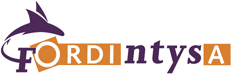

## </img>&nbsp;&nbsp;Build Server

This is your private build server running in a Docker container.

The goal of this workshop is to give you some hands-on experience with the apps listed in the menu bar on the bottom.

----

Page navigation:

  - 
Just press **Space** for the next slide

  - 
**Down** goes to the next page within a chapter

  - 
**Right** skips to the next chapter

  - 
For more keyboard shortcuts: press **?**

##  GitLab - Register & Login

  - Click the __GitLab__ shortcut in the menu bar
  - NB: it might take a while before the container is ready
  - Register yourself as a new user and log in

##  GitLab - New Repository
